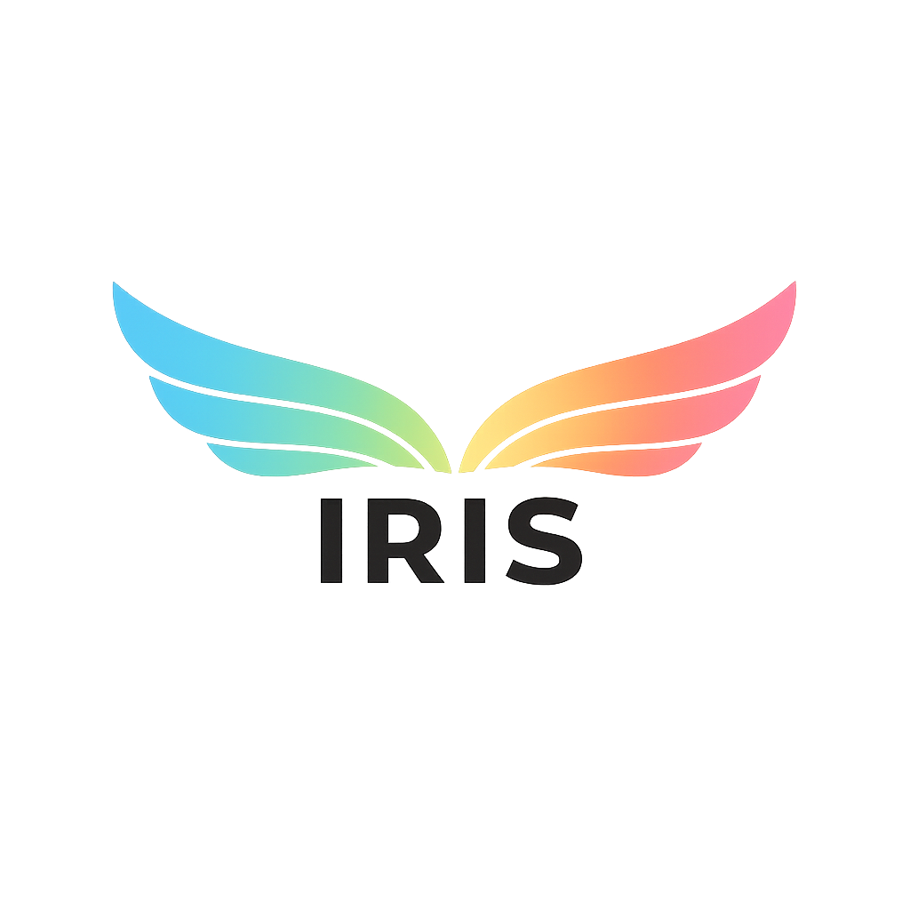
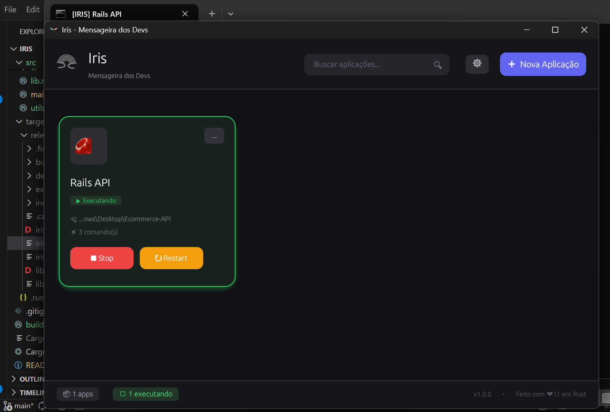

<div align="center">
  
  
  # Iris
  ### Dev Environment Launcher
  
  **Inicie todos os seus projetos com um clique**
  
  [](https://github.com/leonardo-matheus/iris/releases)
  [](https://www.rust-lang.org/)
  [](LICENSE)
  [](https://www.microsoft.com/windows)
  
  <br>
  
  
  
  <br>
  
  *Na mitologia grega, Iris é a deusa do arco-íris e mensageira dos deuses — a ponte entre o Olimpo e os mortais.*
</div>

---

##  A História por trás do Iris

> **"Todo dia era a mesma rotina..."**

Como desenvolvedor senior, eu chegava ao trabalho e precisava executar uma sequência de comandos no terminal para iniciar meu ambiente de desenvolvimento:

```bash
# Terminal 1: Gateway
cd C:\projetos\gateway
npm install
npm run dev

# Terminal 2: Dashboard
cd C:\projetos\dashboard
yarn install
yarn dev

# Terminal 3: API
cd C:\projetos\api
docker-compose up

# Terminal 4: Microserviços
cd C:\projetos\services
cargo run
```

**Eram 4 terminais, 12 comandos, e 5 minutos perdidos toda manhã.** Sem contar quando precisava reiniciar algo...

Foi então que nasceu o **Iris** - um hub centralizado que executa todos esses comandos com um único clique, mantém controle do que está rodando, e me permite parar/reiniciar qualquer aplicação instantaneamente.

**Agora, em vez de 5 minutos, levo 5 segundos.**

---

##  Funcionalidades

| Feature | Descrição |
|---------|-----------|
|  **Adicionar Aplicações** | Configure nome, ícone, diretório e comandos |
|  **+400 Ícones** | Escolha entre centenas de ícones de tecnologias |
|  **Comandos Personalizáveis** | Adicione quantos comandos forem necessários |
|  **Reordenação** | Reorganize a ordem dos comandos com drag & drop |
|  **Busca Rápida** | Encontre suas aplicações instantaneamente |
|  **Persistência** | Configurações salvas automaticamente |
|  **Terminal Nativo** | Abre terminais Windows reais |
|  **Status Visual** | Cards verdes indicam apps em execução |
|  **Scripts Interativos** | Suporte a inputs automáticos para .bat |
|  **Exportar/Importar** | Compartilhe configs com seu time |

###  Controles de Processo

-  **Executar**: Inicia a aplicação em um novo terminal
-  **Stop**: Para a aplicação em execução (mata processos filhos)
-  **Restart**: Reinicia a aplicação com um clique

---

---

##  Instalação

### Download Direto (Recomendado)

Baixe a última versão do executável:

 **[Download Iris v1.0.0](https://github.com/leonardo-matheus/iris/releases/download/v1.0.0/iris.exe)**

### Compilar do Código Fonte

**Pré-requisitos:**
- [Rust](https://rustup.rs/) 1.70 ou superior

```bash
# Clone o repositório
git clone https://github.com/leonardo-matheus/iris.git
cd iris

# Executar em modo desenvolvimento
cargo run

# Compilar versão release (otimizada)
cargo build --release
```

O executável será gerado em `target/release/iris.exe`

---

##  Como Usar

### 1 Adicionar uma aplicação

1. Clique em **" Nova Aplicação"**
2. Escolha um **ícone** (React, Python, Docker, etc.)
3. Defina o **nome** da aplicação
4. Selecione a **pasta do projeto**
5. Adicione os **comandos** na ordem desejada
6. Clique em **" Criar"**

### 2 Executar

Clique em **" Executar"** no card da aplicação. Um terminal Windows será aberto executando os comandos em sequência.

### 3 Gerenciar

- **Parar**: Clique em **" Stop"** para encerrar todos os processos
- **Reiniciar**: Clique em **" Restart"** para parar e iniciar novamente
- **Editar**: Clique em **"..."** para modificar a configuração

---

##  Exemplos de Configuração

<details>
<summary><b> Aplicação React</b></summary>

```yaml
Ícone: react
Nome: Frontend Dashboard
Pasta: C:\projetos\dashboard
Comandos:
  1. npm install
  2. npm run dev
```
</details>

<details>
<summary><b> API Python + FastAPI</b></summary>

```yaml
Ícone: python
Nome: API Backend
Pasta: C:\projetos\api
Comandos:
  1. pip install -r requirements.txt
  2. uvicorn main:app --reload
```
</details>

<details>
<summary><b> Servidor Rust</b></summary>

```yaml
Ícone: rust
Nome: Gateway Service
Pasta: C:\projetos\gateway
Comandos:
  1. cargo build --release
  2. cargo run --release
```
</details>

<details>
<summary><b> Docker Compose</b></summary>

```yaml
Ícone: docker
Nome: Infraestrutura
Pasta: C:\projetos\infra
Comandos:
  1. docker-compose up -d
```
</details>

<details>
<summary><b> Spring Boot (com seleção de versão Node)</b></summary>

```yaml
Ícone: spring
Nome: Spring App
Pasta: C:\projetos\spring-app
Comandos:
  1. setPath.bat      # Script interativo
  2. 18.12.0          # Input automático (versão do Node)
  3. mvn spring-boot:run
```
</details>

---

##  Arquitetura

O Iris foi desenvolvido seguindo uma arquitetura de **microserviços internos** em Rust:

```
src/
 main.rs              # Ponto de entrada
 lib.rs               # Biblioteca e exports

 core/                #  Núcleo da aplicação
    mod.rs
    models.rs        # Estruturas de dados (AppConfig, AppState)
    config.rs        # Gerenciamento de configuração

 services/            #  Serviços de negócio
    mod.rs
    process_manager.rs  # Gerenciamento de processos
    icon_service.rs     # Cache e renderização de ícones

 ui/                  #  Interface gráfica
    mod.rs
    app_hub.rs       # Aplicação principal
    theme.rs         # Cores e estilos
    components/      # Componentes reutilizáveis
       app_card.rs
       header.rs
       footer.rs
       empty_state.rs
    dialogs/         # Modais e diálogos
        app_modal.rs
        delete_confirm.rs

 utils.rs             #  Funções utilitárias
```

### Tecnologias

| Tecnologia | Uso |
|------------|-----|
| **[Rust](https://www.rust-lang.org/)** | Linguagem principal |
| **[egui/eframe](https://github.com/emilk/egui)** | Interface gráfica imediata |
| **[resvg](https://github.com/RazrFalcon/resvg)** | Renderização de SVG |
| **[serde](https://serde.rs/)** | Serialização JSON |
| **[rfd](https://github.com/PolyMeilex/rfd)** | Diálogos de arquivo nativos |

---

##  Exportar e Importar

Compartilhe suas configurações com seu time!

### Exportar
1. Clique no botão **** no header
2. Selecione **" Exportar configurações"**
3. Salve o arquivo `iris-config.json`

### Importar
1. Clique no botão **** no header
2. Selecione **" Importar configurações"**
3. Selecione o arquivo `.json`
4. As aplicações serão **adicionadas** às existentes

---

##  Ícones Disponíveis

Iris inclui **+400 ícones** de tecnologias do [Devicon](https://devicon.dev/):

| Categoria | Exemplos |
|-----------|----------|
| **Frontend** | react, angular, vue, svelte, nextjs, nuxt |
| **Backend** | nodejs, express, fastapi, spring, django |
| **Linguagens** | typescript, python, rust, go, java, kotlin |
| **DevOps** | docker, kubernetes, aws, azure, jenkins |
| **Databases** | postgresql, mongodb, mysql, redis, sqlite |
| **Mobile** | flutter, react-native, android, ios, swift |

---

##  Configurações

As configurações são salvas automaticamente em:

```
Windows: %APPDATA%\iris\config.json
```

---

##  Contribuindo

Contribuições são bem-vindas! 

1. Fork o projeto
2. Crie sua branch (`git checkout -b feature/AmazingFeature`)
3. Commit suas mudanças (`git commit -m 'Add: Amazing Feature'`)
4. Push para a branch (`git push origin feature/AmazingFeature`)
5. Abra um Pull Request

---

##  Licença

Distribuído sob a licença MIT. Veja [LICENSE](LICENSE) para mais informações.

---

##  Agradecimentos

- [Devicon](https://devicon.dev/) pelos ícones de tecnologias
- [egui](https://github.com/emilk/egui) pela biblioteca de UI incrível
- Comunidade Rust pelo ecossistema fantástico

---

<div align="center">
  <br>
  <sub>Feito com ❤️ em Rust por desenvolvedores, para desenvolvedores.</sub>
  <br><br>
  <b>⭐ Se este projeto te ajudou, considere dar uma estrela!</b>
</div>